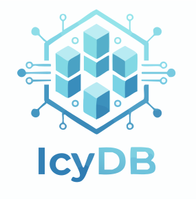

[](https://github.com/dragginzgame/icydb/actions/workflows/ci.yml)
[](LICENSE-APACHE)

# IcyDB — Data Model Framework for the Internet Computer

 

> Battle-tested, schema-first data models for Internet Computer canisters.
> Built for [Dragginz](https://dragginz.io/), now open to everyone.

---

## 👋 Overview

**IcyDB** is a Rust framework for building **strongly-typed, queryable data models**
inside Internet Computer canisters.

It provides:
- declarative entity definitions,
- typed query intent with explicit semantics,
- deterministic planning and execution,
- and stable-memory–backed storage with predictable behavior.

IcyDB is designed for **single-message atomicity**, explicit correctness guarantees,
and mechanical enforcement of architectural boundaries.

---

## ✨ Highlights

- **Entity macros** — define schema-first entities declaratively.
- **Typed query intent** — build queries as `Query<E>` with explicit semantics.
- **Deterministic planning** — validated, executor-safe plans only.
- **Stable storage** — data is persisted in stable memory (not heap), with deterministic commit and recovery, backed by CanIC B-trees.
- **Path dispatch** — `icydb_build` generates internal routing helpers.
- **Observability endpoints** — `icydb_snapshot`, `icydb_metrics`, `icydb_metrics_reset`.
- **IC integration** — ergonomic `icydb::build!` and `icydb::start!` macros.
- **Testability** — fixtures, predicate validation, index testing utilities.

---

## ⚡ Quick Start

### Toolchain

- **Rust 1.93.1** (edition 2024)
- Install with:
  ```bash
  rustup toolchain install 1.93.1
  ```

### Add IcyDB

Use a pinned git tag for reproducible builds:

```toml
[dependencies]
icydb = { git = "https://github.com/dragginzgame/icydb.git", tag = "v0.0.1" }
```

---

## 🚀 Example

### Define an entity

```rust
use icydb::prelude::*;

#[entity(
    pk(field = "id", source = "internal"), // use "external" when IDs are supplied externally
    fields(
        field(ident = "id", value(item(prim = "Ulid"))),
        field(ident = "name", value(item(prim = "Text"))),
        field(ident = "description", value(item(prim = "Text"))),
    ),
)]
pub struct User;
```

Primary keys use `pk(field = "id", source = "internal" | "external")`.

---

### Build and execute a query

Queries are built as **typed intent** and executed through the public session facade.
For session-bound fluent queries, use `db!().load::<User>()` (returns `SessionLoadQuery`)
or `db!().delete::<User>()` (returns `SessionDeleteQuery`).

```rust
use icydb::prelude::*;

pub fn users_named_ann() -> Result<Vec<View<User>>, icydb::Error> {
    let views = db!()
        .load::<User>()
        .filter_expr(FilterExpr::eq("name", "ann"))?
        .order_by("name")
        .offset(100)
        .limit(50)
        .views()?;

    Ok(views)
}
```

Key properties:

* Entity type is fixed at construction (`Query<User>`).
* Missing-row behavior is explicit (`ReadConsistency`).
* Session execution uses validated plans internally; planner/executor internals are not part of the facade contract.
* Primary-key predicates use the normal predicate surface; the planner may optimize them into key/index access paths.
* `by_id`/`by_ids` are ergonomic helpers over typed primary-key values (`Id<E>`) for entity-kind correctness; IDs are public lookup inputs, not authorization tokens.
* Ordering coercion defaults are unified across `FieldRef` and `FilterExpr` (`NumericWiden` for `Lt`/`Lte`/`Gt`/`Gte`). See `docs/QUERY_CONTRACT.md` and `docs/QUERY_PRACTICE.md` for full predicate semantics.
* Identity and primary-key invariants are defined in `docs/IDENTITY_CONTRACT.md`.

---

## 🏗️ Project Layout

* `icydb/` — meta crate re-exporting the public API.
* `crates/icydb-core` — runtime (entities, traits, query engine, stores).
* `crates/icydb-schema-derive` — proc-macros for schema, traits, and views.
* `crates/icydb-schema` — schema AST, builder, and validation.
* `crates/icydb-build` — build-time codegen for actors, queries, metrics.
* `crates/icydb-schema-tests` — integration and design tests.
* `assets/`, `scripts/`, `Makefile` — docs, helpers, workspace tasks.

---

## 📟 Observability & Tooling

The following endpoints are generated automatically:

* `icydb_snapshot()` → live `StorageReport`
* `icydb_metrics(since_ms: Option<u64>)` → metrics window report, filtered by window start timestamp
* `icydb_metrics_reset()` → clears metrics state

Example usage:

```bash
dfx canister call <canister> icydb_snapshot
dfx canister call <canister> icydb_metrics '(null)'
dfx canister call <canister> icydb_metrics '(opt 1735689600000)'
dfx canister call <canister> icydb_metrics_reset
```

---

## 🧑‍💻 Local Development

Workspace commands (see `Makefile`):

```bash
make check      # type-check workspace
make clippy     # lint (warnings denied)
make test       # unit + integration tests
make fmt        # format workspace
make build      # release build
```

Pre-commit hooks run:

* `cargo fmt -- --check`
* `cargo sort --check`
* `cargo sort-derives --check`

---

### Style & Conventions

* Prefer typed errors (`thiserror`) over panics in library code.
* Keep functions small and single-purpose.
* Use explicit semantics over implicit defaults.
* Co-locate unit tests; integration tests live under `crates/icydb-schema-tests`.
* No backward-compatibility guarantee yet — breaking changes are documented.

---

## 🔒 Versioning & Security

* Git tags are treated as **immutable by project policy**.
* Production users should always pin to a specific tag.
* Floating branches are not recommended for production.

Verify available tags:

```bash
git ls-remote --tags https://github.com/dragginzgame/icydb.git
```

---

## 📊 Current Focus

* Expanding documentation and runnable examples.
* Increasing test coverage across query and index paths.
* Tracking memory usage and store statistics in production.
* Reducing WASM size produced by `icydb_build`.
* Defining and delivering future transactional semantics (see `docs/ROADMAP.md`).

---

## 📄 License

Licensed under either of:

* Apache License, Version 2.0 (`LICENSE-APACHE`)
* MIT License (`LICENSE-MIT`)

at your option.
