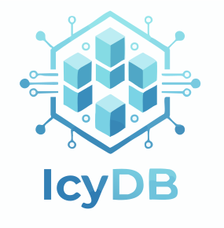

[](https://github.com/dragginzgame/icydb/actions/workflows/ci.yml)
[](LICENSE-APACHE)

# IcyDB — Query Execution Engine + Typed Models for Internet Computer Canisters

 

> Schema-first entity modeling plus a deterministic query execution engine for IC canisters.
> Built for [Dragginz](https://dragginz.io/), now open to everyone.

---

## SQL Quickstart

Use this when working inside this repo with the test SQL canister.

1. Initialize the SQL harness (deploy + erase fixtures + load defaults):

```bash
scripts/dev/sql.sh --init
```

2. Run one query:

```bash
scripts/dev/sql.sh "select name, charisma from character order by charisma desc limit 5"
```

3. Run one DESCRIBE:

```bash
scripts/dev/sql.sh "describe character"
```

4. Show supported entities (or use the SQL-style alias):

```bash
scripts/dev/sql.sh "show entities"
scripts/dev/sql.sh "show tables"
```

5. Show indexes for one entity:

```bash
scripts/dev/sql.sh "show indexes character"
```

6. Show columns for one entity:

```bash
scripts/dev/sql.sh "show columns character"
```

7. Command split:

```bash
scripts/dev/sql.sh --deploy   # deploy canister only
scripts/dev/sql.sh --reset    # destructive: erase fixtures + reload defaults
scripts/dev/sql.sh --init     # deploy + destructive reset + reload
```

---

## What Is IcyDB?

**IcyDB** is an embedded Rust runtime for canister data with a typed query planner/executor.

You get:

- typed entities and indexes from macros,
- fluent query APIs (`load`, `delete`, grouped/aggregate terminals),
- reduced SQL entrypoints that lower into the same planner/executor,
- stable-memory persistence with guarded recovery for interrupted writes,
- and explain/metrics surfaces for execution observability.

If you are new to this space: think "database-like query execution and safety" while still coding with normal Rust types.

---

## Current Line

- Workspace version on `main`: `0.66.0`
- Latest tagged release in this repo: `v0.66.0`
- Changelog: `CHANGELOG.md`
- Detailed `0.66.x` notes: `docs/changelog/0.66.md`

---

## Recent Highlights

- `0.66.0` keeps row format, SQL behavior, routing, and executor semantics unchanged while splitting several large owner modules into smaller owner-local boundaries so follow-on work lands against narrower surfaces.
- The public mutation API remains the mode-driven `UpdatePatch` + `MutationMode` + `mutate_structural(...)` surface introduced in the `0.64` line.
- Reduced SQL now includes the unified `execute_sql_dispatch` / `sql_dispatch::query(...)` introspection lane plus bounded prefix `LIKE 'prefix%'`, `LOWER(field) LIKE 'prefix%'`, and `UPPER(field) LIKE 'prefix%'` lowering.
- SQL remains default-on. Disable default features to compile out the public SQL APIs and generated canister `sql_dispatch` glue while keeping the typed runtime/query path.
- Repo-managed cargo flows use IcyDB-local cargo state, which helps keep local build/test/check runs from contending with sibling repositories on the same filesystem.

---

## Why Use It?

- **Real query execution engine**: intent -> planner -> executor, not just macro-generated structs.
- **Deterministic pagination**: cursor tokens are forward-only and bound to canonical query shape.
- **Fluent + SQL surfaces**: use typed Rust builders or reduced SQL, both routed through one runtime.
- **Stable-memory durability**: data survives upgrades and write interruption recovery is explicit.
- **Execution observability**: `EXPLAIN`, trace metadata, and row-flow counters support debugging.

---

## Library Quick Start

### 1. Toolchain

- Rust `1.94.1` (edition 2024)

```bash
rustup toolchain install 1.94.1
```

### 2. Add IcyDB

Use a pinned git tag so builds are repeatable. SQL is enabled by default:

```toml
[dependencies]
icydb = { git = "https://github.com/dragginzgame/icydb.git", tag = "v0.66.0" }
```

Compile out the SQL frontend if you only use typed Rust APIs:

```toml
[dependencies]
icydb = { git = "https://github.com/dragginzgame/icydb.git", tag = "v0.66.0", default-features = false }
```

With `default-features = false`, `db::sql::*`, SQL session helpers, and generated
`sql_dispatch` modules are not available.

---

## Example

### Define an entity

```rust
use icydb::prelude::*;

#[entity(
    pk(field = "id", source = "internal"), // use "external" if IDs come from callers
    fields(
        field(ident = "id", value(item(prim = "Ulid"))),
        field(ident = "name", value(item(prim = "Text"))),
        field(ident = "description", value(item(prim = "Text"))),
    ),
)]
pub struct User;
```

### Run a typed fluent query

```rust
use icydb::prelude::*;

pub fn users_named_ann() -> Result<Vec<User>, icydb::Error> {
    let users = db!()
        .load::<User>()
        .filter_expr(FilterExpr::eq(User::NAME, "ann"))?
        .order_by("name")
        .offset(100)
        .limit(50)
        .entities()?;

    Ok(users)
}
```

### Apply one mutation

```rust
use icydb::prelude::*;
use icydb::db::{MutationMode, UpdatePatch};

pub fn rename_user(user_id: Ulid, new_name: String) -> Result<(), icydb::Error> {
    let patch = UpdatePatch::new()
        .set_field(User::MODEL, "id", Value::Ulid(user_id))?
        .set_field(User::MODEL, "name", Value::Text(new_name))?;

    db!().mutate_structural::<User>(user_id, patch, MutationMode::Update)?;

    Ok(())
}
```

Mode semantics:

- `Insert` requires one full after-image patch and fails if the row already exists.
- `Update` applies one patch over one existing row and fails if the row is missing.
- `Replace` requires one full after-image patch, rebuilds from an empty row image, and inserts if the row is missing.

### Explain one query before execution

```rust
use icydb::prelude::*;

pub fn explain_users_named_ann() -> Result<String, icydb::Error> {
    let explain = db!()
        .load::<User>()
        .filter_expr(FilterExpr::eq(User::NAME, "ann"))?
        .order_by("name")
        .limit(25)
        .explain_execution_verbose()?;

    Ok(explain)
}
```

### Execute reduced SQL (same planner/executor path)

```rust
use icydb::prelude::*;

let projected = db!().execute_sql_projection::<User>(
    "SELECT id, name FROM User WHERE LOWER(name) LIKE 'ann%' ORDER BY id LIMIT 25",
)?;

let grouped = db!().execute_sql_grouped::<User>(
    "SELECT name, COUNT(id) FROM User GROUP BY name ORDER BY name LIMIT 10",
    None,
)?;
```

### Expose SQL endpoints in your canister (generated dispatch)

When the `sql` feature is enabled, `icydb::start!()` generates a `sql_dispatch`
module for your canister schema. Use it to expose a small SQL API without
hand-written per-entity routing:

```rust
use ic_cdk::query;

icydb::start!();

#[cfg(feature = "sql")]
use icydb::db::sql::SqlQueryResult;

#[cfg(feature = "sql")]
#[query]
fn sql_entities() -> Vec<String> {
    sql_dispatch::entities()
}

#[cfg(feature = "sql")]
#[query]
fn query(sql: String) -> Result<SqlQueryResult, icydb::Error> {
    sql_dispatch::query(sql.as_str())
}
```

When `sql` is disabled, omit these endpoints and use the typed query APIs only.

What each endpoint returns:

- `sql_entities`: supported SQL entity names for this canister.
- `query`: one typed `SqlQueryResult` enum payload:
  - `Projection(SqlQueryRowsOutput)`
  - `Explain { entity, explain }`
  - `Describe(EntitySchemaDescription)`
  - `ShowIndexes { entity, indexes }`
  - `ShowColumns { entity, columns }`
  - `ShowEntities { entities }` for `SHOW ENTITIES` and `SHOW TABLES`

Dispatch behavior:

- Routing is keyed by the parsed SQL entity name.
- Unknown entities fail immediately with one deterministic unsupported-entity error listing supported entities.
- `EXPLAIN` follows execution parity: invalid/non-executable queries are rejected (for example unordered `LIMIT/OFFSET`).

Example calls:

```bash
dfx canister call <canister> sql_entities
dfx canister call <canister> query '("SHOW TABLES")'
dfx canister call <canister> query '("SELECT id, name FROM User ORDER BY id LIMIT 5")'
dfx canister call <canister> query '("EXPLAIN SELECT id, name FROM User ORDER BY id LIMIT 5")'
```

---

## Query Engine Notes

- `db!().load::<User>()` and `db!().delete::<User>()` build typed query intent.
- Planning validates fields/operators/coercions, then chooses a valid access strategy.
- Execution performs defensive boundary validation and fail-closed cursor checks.
- Cursor pagination requires ordered queries and appends primary-key tie-break ordering when needed.
- Grouped execution is explicit and bounded by runtime resource guards.

For contract-level behavior:

- `docs/contracts/QUERY_CONTRACT.md`
- `docs/contracts/QUERY_PRACTICE.md`
- `docs/contracts/RESOURCE_MODEL.md`
- `docs/contracts/SQL_SUBSET.md`
- `docs/contracts/TRANSACTION_SEMANTICS.md`

### Aggregate terminals

```rust
use icydb::prelude::*;

let median_rank_id = db!()
    .load::<User>()
    .filter_expr(FilterExpr::eq(User::GROUP, 7))?
    .order_by("id")
    .median_by("rank")?;

let distinct_ranks = db!()
    .load::<User>()
    .filter_expr(FilterExpr::eq(User::GROUP, 7))?
    .order_by("id")
    .count_distinct_by("rank")?;

let min_max_rank_ids = db!()
    .load::<User>()
    .filter_expr(FilterExpr::eq(User::GROUP, 7))?
    .order_by("id")
    .min_max_by("rank")?;
```

### Batch writes: choose your lane

IcyDB has two explicit batch-write behaviors:

- `*_many_atomic`: all-or-nothing for a **single entity type per call**
- `*_many_non_atomic`: fail-fast, earlier items may commit before a later error

```rust
use icydb::prelude::*;

// Single-entity-type atomic batch:
// either all User rows commit, or none do.
let users = vec![user_a, user_b, user_c];
let _saved = db!().insert_many_atomic::<User>(users)?;

// Non-atomic batch:
// earlier rows may already be committed if a later row fails.
let _maybe_partial = db!().insert_many_non_atomic::<User>(more_users)?;
```

`*_many_atomic` is not a multi-entity transaction API. Coordinating `User` and `Order`
in one atomic transaction is out of scope for the current surface.

---

## Reduced SQL Scope (Current 0.66 Line)

Executable SQL entrypoints:

- `execute_sql` for entity-shaped `SELECT`/`DELETE`
- `execute_sql_projection` for projection-shaped `SELECT` and row-returning `DELETE`
- `execute_sql_dispatch` for one unified `SqlQueryResult` envelope across query and introspection lanes
- `execute_sql_grouped` for constrained grouped aggregates
- `execute_sql_aggregate` for constrained global aggregates
- `explain_sql` for `EXPLAIN` wrappers over executable reduced SQL

Dedicated SQL introspection commands through unified dispatch:

- `DESCRIBE <entity>`
- `SHOW INDEXES <entity>`
- `SHOW COLUMNS <entity>`
- `SHOW ENTITIES`
- `SHOW TABLES`

Out of scope and fail-closed by design:

- `INSERT`, `UPDATE`
- joins/subqueries/CTEs
- table aliases
- quoted identifiers
- window functions
- `LIKE` patterns outside bounded trailing-wildcard prefix forms (`field LIKE 'prefix%'`, `LOWER(field) LIKE 'prefix%'`, `UPPER(field) LIKE 'prefix%'`)

---

## Project Layout

- `crates/icydb` — public API crate.
- `crates/icydb-core` — runtime, planner, executor, stores.
- `crates/icydb-derive` — derive macros and helper codegen surfaces.
- `crates/icydb-primitives` — shared primitive/domain types.
- `crates/icydb-schema-derive` — procedural macros for schema/types.
- `crates/icydb-schema` — schema AST and validation.
- `crates/icydb-build` — build-time codegen for canister wiring.
- `canisters/minimal`, `canisters/one_simple`, `canisters/one_complex`, `canisters/ten_simple`, `canisters/ten_complex` — SQL canister harnesses used for wasm footprint auditing across small and larger audit fixture sets.
- `canisters/quickstart` — SQL quickstart canister harness for onboarding and integration flows.
- `schema/minimal`, `schema/one_simple`, `schema/one_complex`, `schema/ten_simple`, `schema/ten_complex` — matching audit schema fixtures used by the wasm footprint matrix.
- `schema/quickstart` — SQL quickstart canister schema fixtures.
- `schema/test` — shared schema fixtures for macro/e2e test harnesses.
- `testing/macro-tests` — macro and schema contract tests.
- `testing/pocket-ic` — Pocket-IC integration tests for canister flows.
- `testing/wasm-fixtures` — shared generated-surface assertions and helpers for the wasm audit canisters.
- `assets`, `scripts`, `Makefile` — docs, helpers, workspace commands.

---

## Schema Crates

IcyDB keeps schema definitions in dedicated crates so canister builds only link
the schema surface they need.

- `schema/quickstart` holds the SQL quickstart canister schema surface.
- `schema/test` holds shared schema fixtures used by macro/e2e test harnesses.
- `canisters/quickstart/src/seed` holds deterministic quickstart fixture datasets.
- `schema/minimal`, `schema/one_simple`, `schema/one_complex`, `schema/ten_simple`, and `schema/ten_complex` hold the audit fixture families used by the corresponding wasm footprint canisters.
- `testing/wasm-fixtures` holds shared generated actor / `sql_dispatch` assertions used across those audit canisters.

This split keeps the wasm audit baseline from absorbing unrelated fixture schema
weight while preserving full-featured fixtures for test harnesses.

---

## Observability Endpoints

IcyDB generates these canister methods for every canister:

- `icydb_snapshot()` -> current storage report
- `icydb_metrics(window_start_ms: Option<u64>)` -> metrics window filter
- `icydb_metrics_reset()` -> clears in-memory metrics

Example:

```bash
dfx canister call <canister> icydb_snapshot
dfx canister call <canister> icydb_metrics '(null)'
dfx canister call <canister> icydb_metrics '(opt 1735689600000)'
dfx canister call <canister> icydb_metrics_reset
```

---

## Local Development

```bash
make check      # type-check workspace
make clippy     # lint (warnings denied)
make test       # unit + integration tests
make fmt        # format workspace
make build      # release build
make wasm-size-report   # build/report wasm sizes for minimal + one/ten simple/complex audit canisters
make wasm-audit-report  # write dated wasm+twiggy audit reports for the audit canisters under docs/audits/reports
```

Pre-commit hooks run:

```bash
cargo fmt --all -- --check
cargo sort --check
cargo sort-derives --check
```

---

## Versioning and Security

- Tags are treated as immutable.
- Pin to a specific tag in production.
- Avoid floating branches for production deployments.

Check tags:

```bash
git ls-remote --tags https://github.com/dragginzgame/icydb.git
```

---

## Current Focus

- Preserve grouped/HAVING, continuation, and resource-model invariants while consolidation work continues behind the same public contracts.
- Keep complexity hotspots partitioned into owner-local modules instead of letting large mixed roots regrow.
- Continue numeric and semantic-duplication cleanup without widening public APIs or changing row/query contracts.
- Preserve deterministic local SQL harness flows (`scripts/dev/sql.sh`), wasm audit baselines, and CI parity.
- Keep `CandidType` wire-surface comments as plain `//` comments instead of `///` doc comments so normal canister builds do not retain those strings in wasm.
- Track active work in `docs/ROADMAP.md` and current design docs under `docs/design/`.

---

## License

Licensed under either:

- Apache License, Version 2.0 (`LICENSE-APACHE`)
- MIT License (`LICENSE-MIT`)

at your option.
