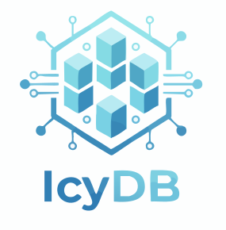

[](https://github.com/dragginzgame/icydb/actions/workflows/ci.yml)
[](LICENSE-APACHE)

# IcyDB



IcyDB is a schema-first persistence and query runtime for Internet Computer
canisters. It gives Rust canisters typed entities, stable-memory storage,
accepted schema catalogs, indexes, typed queries, a reduced single-entity SQL
surface, pagination, grouped aggregates, DDL-backed catalog mutation, and
generated observability endpoints.

Current workspace version: `0.233.3`

IcyDB's dependency-facing minimum supported Rust version is `1.88.0` for the
public `icydb` crate path and its library dependencies. Other workspace
packages declare a `1.96.0` Rust floor;
repository development, formatting, Clippy, tests, CI, and release builds use
the pinned Rust `1.97.1` toolchain.

For local development setup, test prerequisites, and troubleshooting, see
[INSTALLING.md](INSTALLING.md). Safety notes for host-touching commands live in
[SECURITY.md](SECURITY.md).

## Current Shape

- Schema macros declare canisters, stores, entities, fields, indexes, records,
  enums, collection types, validators, normalizers, and explicit relations.
- Accepted schema snapshots are the runtime authority for row layouts, index
  catalogs, schema reconciliation, SQL DDL, and observability.
- Primary keys can be scalar or composite. Composite keys use ordered
  components and generated key structs.
- Every declared relation is validated at write and delete time. Identifiers
  that intentionally permit missing targets remain ordinary key-typed fields.
  Scalar and composite relation identities use full accepted primary-key
  metadata; collection relations to composite targets remain intentionally
  deferred.
- SQL is intentionally single-entity. It is useful for canister-local reads,
  writes, aggregates, introspection, and accepted-catalog DDL, not joins or
  general relational workloads.

## Use IcyDB

Pin IcyDB by tag in downstream canisters:

```toml
[dependencies]
icydb = { git = "https://github.com/dragginzgame/icydb.git", tag = "v0.233.3" }
```

Base IcyDB provides accepted-schema runtime support together with structural,
typed, and dynamic reads and writes. Enable `sql` only when the canister uses
session/library SQL APIs or generated SQL endpoints; SQL is an optional
frontend over the same engine-neutral query runtime.

IcyDB has three optional Cargo features:

- `sql` adds SQL, including `EXPLAIN`, `DESCRIBE`, and `SHOW`.
- `diagnostics` adds detailed execution attribution for profiling and audits.
- `migration` adds explicit schema-migration operations and endpoints.

Compact and extended metrics types are part of base IcyDB. The explicit
`icydb_metrics_extended` source declaration, rather than another Cargo feature,
selects the public extended-metrics endpoint.

Application schema crates depend separately on `icydb-model`; the runtime
`icydb` facade does not re-export model declaration macros. Low-level tools
that construct schema proposals or inspect canonical scalar metadata may
depend on `icydb-schema` directly.

Canisters normally call `icydb::start!()` in `src/lib.rs`, add `icydb` as a
build dependency using the same tag, and call
`icydb::build::build_canister!(SchemaCanister)` in `build.rs`. Public IcyDB
methods are declared explicitly beside `start!()` with `icydb::endpoints!`.
Applications that only need install or post-upgrade callbacks use the composed
`start!` form so IcyDB registers recovery first. Applications or frameworks
that must own the complete lifecycle root use `start!(participant)`, invoke
the matching hidden participant synchronously, and schedule no
database-dependent work before that call returns. Both forms must poll typed
readiness before restoring application timers or caches. See
[startup readiness](docs/guides/startup-readiness.md).

```toml
[build-dependencies]
icydb = { git = "https://github.com/dragginzgame/icydb.git", tag = "v0.233.3" }
```

## Minimal Schema

Schema definitions normally live in a small schema crate used by the canister.
See [Schema authoring](docs/guides/schema-authoring.md) for primary-key types,
reserved names, relation suffixes, and host/Wasm crate layouts.

```rust
use icydb_model::prelude::*;

#[canister(
    memory_namespace = "app",
    memory_min = 100,
    memory_max = 104,
    commit_memory_id = 104
)]
pub struct AppCanister {}

#[store(
    canister = "AppCanister",
    storage(journaled(
        data_memory_id = 100,
        index_memory_id = 101,
        schema_memory_id = 102,
        journal_memory_id = 103,
    ))
)]
pub struct AppStore {}

#[entity(
    store = "AppStore",
    version = 1,
    pk(field = "id"),
    index(field = "name"),
    index(fields = ["active", "score"]),
    constraint(
        name = "score_nonnegative",
        check = "score >= 0"
    ),
    fields(
        field(
            name = "id",
            value(item(prim = "Ulid")),
            generated(insert = "Ulid::generate")
        ),
        field(
            name = "name",
            value(item(prim = "Text", unbounded))
        ),
        field(
            name = "active",
            value(item(prim = "Bool"))
        ),
        field(
            name = "score",
            value(item(prim = "Decimal", scale = 3))
        )
    ),
    timestamps
)]
pub struct User {}

```

Entity and named-type names come from their Rust declarations. Nested fields,
variants, relations, constraints, and rules use one `name = "..."` vocabulary;
indexes derive canonical names from their entity and key shape. The main branch
also accepts strict scalar shorthand such as `pk(field = "id")` and
`index(field = "name")`. Composite keys use ordered field lists such as
`pk(fields = ["tenant_id", "local_id"])`.
Managed timestamps are likewise explicit: place `timestamps` after
`fields(...)`, or omit it when an entity should have no database-managed
timestamp fields. The bare form creates conventional `created_at` and
`updated_at` `Timestamp` fields. Either current name can be overridden with
`timestamps(created_at(name = "inserted_at"), updated_at(name = "modified_at"))`;
an omitted nested entry retains its conventional name.
Entity and store names come directly from their Rust declarations; neither
macro accepts a second name or generated-symbol override.

Schema evolution uses explicit adjacent per-entity versions and a coordinated
canister-owned plan; it never infers a rename from generated identifiers. See
[Schema Migrations](docs/guides/schema-migrations.md) for adoption, deployment,
bounded advancement, recovery, and abort guidance.

Typed adapters are automatic when the schema crate depends on the `icydb`
runtime facade. Named enums, records, newtypes, lists, sets, maps, and tuples
implement the model-owned adapter traits directly, including the built-in
types under `icydb_model::base::types`. A schema-only crate can omit `icydb`
and remains independent of runtime and persistence. No suffix-derived sibling
types are created, so names such as `X` and `XEntity` can coexist.

For macro-development diagnostics, place `#[debug]` on the public struct
immediately below an IcyDB model attribute. The macro intentionally emits its
generated Rust as a compiler error so it can be inspected during testing;
remove `#[debug]` for normal compilation.

## Generated Numeric Identities

Use `Identity::next` when one entity needs a database-authored sequential
unsigned primary key:

```rust
#[entity(
    store = "AppStore",
    version = 1,
    pk(field = "id"),
    fields(
        field(
            name = "id",
            value(item(prim = "Nat64")),
            generated(insert = "Identity::next")
        ),
        field(name = "name", value(item(prim = "Text", unbounded)))
    )
)]
pub struct Project {}
```

The supported exact kinds are `Nat8`, `Nat16`, `Nat32`, `Nat64`, and
`Nat128`; `Nat64` is the normal default. Values start at one, advance by one,
never cycle, and are generated only for logical inserts. Rejected writes
consume nothing, but deleting a committed row does not make its value reusable,
so visible IDs are not guaranteed to be dense.

Generated typed insert inputs omit `id`. SQL can omit the field or use
`DEFAULT`, and `RETURNING` obtains the generated value:

```sql
INSERT INTO Project (name) VALUES ('North') RETURNING id;
INSERT INTO Project (id, name) VALUES (DEFAULT, 'South') RETURNING id;
```

SQL DDL such as `GENERATED ALWAYS AS IDENTITY` is not accepted yet; the schema
macro remains the authoring surface. Ordinary Nat primary keys without
`generated(insert = "Identity::next")` remain caller-authored. Numeric
Identity is entity-local and store-local; use ULID for decentralized or
cross-system allocation. Narrower Nat kinds constrain the lifetime allocation
domain but do not currently promise smaller physical keys.

## Storage Modes

Stores choose one explicit storage contract:

- `storage(journaled(...))`: durable journaled cached-stable storage. Reads use
  live Rust BTree projections, writes publish marker-bound journal batches, and
  recovery folds committed journal records into canonical stable data, index,
  and schema BTrees.
- `storage(heap())`: volatile Rust `BTreeMap` storage. It is useful for live
  in-process state, tests, and deliberate perf comparisons, but rows and
  indexes are not recovered across upgrade/reinitialization and do not
  participate in the journaled durable commit path.

Journaled stores use four memory IDs: `data_memory_id`, `index_memory_id`,
`schema_memory_id`, and `journal_memory_id`. The first three are the canonical
stable source-of-truth roles; the fourth is the durable journal tail. `heap()`
storage is never durable. Stable allocation keys are derived from the canister
memory namespace, memory ID, and role, so renaming a Rust store does not
redirect its stable memory. Durable examples should use
`storage(journaled(...))` unless volatility is the point of the example. The
full operator-facing durability boundary is documented in
[docs/contracts/DURABILITY.md](docs/contracts/DURABILITY.md).

## Query From Rust

Opted-in generated adapters provide typed reads over accepted schema. Planning,
admission, and execution do not consume generated model metadata. Generated
IcyDB endpoints establish one request scope automatically. Put the thin IcyDB
boundary outside the framework attribute on a manual IC-CDK or Canic endpoint.
Every nested zero-argument `db!()` then shares the same scope, including before
and after `.await`:

```rust,ignore
#[icydb::request_execution]
#[canic_query(requires(auth::authenticated()))]
async fn active_users() -> Result<Vec<User>, Error> {
    authorize().await?;
    load_active_users()
}
```

```rust
use icydb::prelude::*;

pub fn top_users() -> Result<Vec<User>, Box<dyn std::error::Error>> {
    let session = db!()?;
    let rows = session
        .query::<User>()?
        .filter(FieldRef::new("active").eq(true))
        .order_by(desc("score"))
        .order_by(asc("id"))
        .limit(10)
        .execute_live_page(None)?
        .rows;

    Ok(rows)
}

pub fn rename_user(
    id: Ulid,
    name: String,
) -> Result<u32, icydb::Error> {
    let session = db!()?;
    let patch = session.structural_patch([(
        "name",
        icydb::db::WriteCell::Value(InputValue::Text(name)),
    )]);
    let result = session.execute_trusted_structural_mutation(
        icydb::db::StructuralMutation::Update {
            entity: "User".to_string(),
            key: InputValue::Ulid(id),
            patch,
        },
    )?;

    Ok(result.affected_rows)
}
```

Ordinary typed reads are bounded by default. Caller-facing endpoints
still enforce caller authorization first and then receive typed errors for
unsafe read shapes. Broad maintenance scans belong on explicit trusted/admin
paths after controller authorization. See the
[public facade API reference](docs/guides/public-facade-api.md) for the current
surface and [READ_ADMISSION.md](docs/contracts/READ_ADMISSION.md)
for the full admission contract.

Base IcyDB also supports SQL-independent grouped typed and dynamic reads.
Grouped calls declare ordered keys and aggregates, require explicit engine and
page limits, and return an opaque continuation cursor; the public facade guide
contains the maintained example.

Use the structural insert-batch helper when a same-entity batch must be
all-or-nothing:

```rust
pub fn import_users(
    patches: Vec<icydb::db::StructuralPatch>,
) -> Result<icydb::db::DynamicMutationResult, icydb::Error> {
    db!()?.execute_trusted_structural_insert_batch("User", patches)
}
```

With the `sql` feature enabled, the same entity can be queried or mutated
through session/library reduced single-entity SQL:

```rust
use icydb::prelude::*;

#[icydb::request_execution]
fn admin_work() -> Result<(), icydb::Error> {
    let session = db!()?;
    let rows = session.execute_trusted_sql_query(
        "SELECT id, name, score FROM User WHERE score >= 100 ORDER BY score DESC LIMIT 10",
    )?;
    let updated = session.execute_trusted_sql_exact_update(
        "UPDATE User SET name = 'Ada' WHERE id = '01J...' RETURNING id, name",
        1,
    )?;

    // Large fixed convergence work uses IcyDB-custodied durable mutation jobs;
    // the application retains only a fresh job ID, sequence, and replay key.

    let ddl = session.execute_admin_sql_ddl(
        "CREATE INDEX IF NOT EXISTS user_score_idx ON User (score)",
    )?;
    consume(rows, updated, ddl);
    Ok(())
}
```

The async boundary retains one counter set across suspension but installs it
only while this future is being polled. Other interleaved messages therefore
cannot inherit its scope. The called canister has a separate IcyDB instance
and creates its own request root.

Use the explicit form only for low-level framework integration that already
owns and passes the root itself:

```rust
let work = icydb::db::with_request_execution_root(|request_root| async move {
    let before = db!(&request_root)?.get(user_id)?;
    call_another_canister().await?;
    let after = db!(&request_root)?.get(user_id)?;
    Ok::<_, icydb::Error>((before, after))
});
let result = work.await?;
```

`db!(&request_root)` does not create another allowance; it attaches the new
session to that root's existing counters. It is not an authorization token and
is never sent to another canister. Passing a different explicit root while a
request root is active returns a typed mismatch error. Do not create a
separate explicit root around each query. Lifecycle hooks, timers, and
background task entry functions that access IcyDB also use
`#[icydb::request_execution]`; synchronous unit tests use `#[icydb::test]`.

`execute_trusted_sql_query` is an explicit trusted/admin SQL bypass. It is not
public-safe for caller-controlled SQL by itself; public reads should prefer
typed APIs or an application-owned SQL allowlist after caller
authorization.

## SQL Scope

IcyDB supports a focused, canister-friendly SQL subset:

- `SELECT`, `EXPLAIN`, compact `DESCRIBE`, `DESCRIBE ... VERBOSE`,
  `SHOW ENTITIES`, `SHOW STORES`, `SHOW MEMORY`, compact/verbose
  `SHOW COLUMNS`, `SHOW RELATIONS`, `SHOW INDEXES`, and `SHOW CONSTRAINTS`
- `INSERT`, `UPDATE`, and `DELETE`, including supported `RETURNING` shapes
- `CREATE INDEX`, `CREATE UNIQUE INDEX`, `CREATE INDEX IF NOT EXISTS`,
  `DROP INDEX`, and `DROP INDEX IF EXISTS`
- `ALTER TABLE ... ADD COLUMN`, `ALTER COLUMN ... SET/DROP DEFAULT`,
  `ALTER COLUMN ... SET/DROP NOT NULL`, `RENAME COLUMN`, and dense-rewrite
  `DROP COLUMN`
- `ALTER TABLE ... ADD CONSTRAINT ... CHECK`, explicit `NOT VALID`, bounded
  `VALIDATE CONSTRAINT`, and ownership-safe `DROP CONSTRAINT`
- `WHERE`, `ORDER BY`, `LIMIT`, `OFFSET`, projection aliases, `DISTINCT`,
  aggregates, grouped aggregates, `HAVING`, searched `CASE`, and common
  scalar/numeric/text functions
- field-path indexes, multi-field indexes, unique indexes, filtered indexes,
  and deterministic `LOWER`/`UPPER`/`TRIM` expression indexes

Generated checks and SQL DDL checks converge on one accepted constraint
catalog. `SET NOT NULL`, `CREATE UNIQUE INDEX`, and `ADD ... CHECK NOT VALID`
publish an explicit new-write gate when historical proof is required;
`VALIDATE CONSTRAINT` advances the bounded durable proof before atomic
promotion. `SHOW CONSTRAINTS` exposes the same accepted identity and activation
state without performing a table scan.

Reusable durable numeric and length rules also become accepted constraints.
One rule is bound by persisted root field and nominal type, then enforced over
every finite direct or nested occurrence—including recursive named values—by
the same mutation, activation, integrity, and recovery authority.

Rules use a closed typed grammar with named operands:

```rust
use icydb_model::prelude::*;

#[newtype(
    item(prim = "Nat16"),
    ty(
        rule(name = "range", numeric_range_inclusive(min = 0, max = 360)),
        rule(name = "step", multiple_of(divisor = 5)),
    )
)]
pub struct Bearing {}
```

The available operations are `length_range_inclusive`,
`numeric_minimum_inclusive`, `numeric_maximum_inclusive`,
`numeric_range_inclusive`, and exact integer/decimal `multiple_of`. The old
string `kind` and positional rule `args(...)` spelling is removed. Accepted
snapshots written with the retired `ICYT` profile are incompatible development
state and must be recreated; the current profile is `ICYU`.

Application validators and normalizers are explicit typed authoring behavior.
Database writes never invoke them, and they do not become database constraints
or recovery-time policy.

```rust
use icydb_model::{NormalizeAndValidate as _, normalize, validate};
use icydb_model::{base::types::web::MimeType, visitor::VisitorError};

fn prepare_explicitly(mut value: MimeType) -> Result<MimeType, VisitorError> {
    normalize(&mut value)?;
    validate(&value)?;
    Ok(value)
}

fn prepare_conveniently(value: MimeType) -> Result<MimeType, VisitorError> {
    value.normalize_and_validate()
}
```

Direct validation checks the value as supplied. The consuming convenience
normalizes first and validates second. Generated typed adapters perform
neither operation implicitly.

IcyDB SQL is not Postgres-style transaction SQL. Mutation statements are
single-entity IcyDB operations, and returning `Err` from a canister update
method does not roll back earlier state changes made by that method. Use the
structural mutation-batch helper when one same-entity combination of inserts,
updates, replacements, and deletes must be all-or-nothing; the insert-batch
helper is its convenience shape. On the Internet Computer, update calls for
one canister execute one at a time; two concurrent client requests observe
serialized canister state rather than a shared database transaction.

Generated canister SQL endpoints are deliberately narrower than the
session/library SQL APIs. The exported methods are `icydb_query`, `icydb_ddl`,
and `icydb_update` only when their exact declarations appear in the canister
source. Generated Rust wrappers use hidden `__icydb_*` names only to avoid
collisions with non-exported application hooks. Cargo features compile private
capabilities; source declarations alone ask IcyDB to export maintained public
wrappers. Local-only methods use ordinary canister-owned `#[cfg(feature =
"...")]` declarations.
Generated SQL endpoints are controller-gated by default. A source declaration
may instead use `authorization = guard(path)` to replace controller authority
with one synchronous application decision for the complete generated SQL read
lane. Guarded SQL still rejects anonymous callers and never adds an implicit
controller fallback. The dedicated `icydb_schema` declaration independently
accepts `public`, `controller`, or `guard(path)` authority; its schema guard
does not authorize SQL introspection, and the SQL guard does not export the
schema method. Caller-facing list/count/complete reads that need a narrower
shape should be hand-written typed endpoints using the read-intent guidance
and endpoint templates in
[docs/guides/read-intent.md](docs/guides/read-intent.md).

Out of scope by design: joins, subqueries, CTEs, quoted identifiers, window
functions, cursor pagination in scalar SQL, and broad unbounded pattern
matching.

Detailed SQL contract: [docs/contracts/SQL_SUBSET.md](docs/contracts/SQL_SUBSET.md)

## Local Development

Repository setup, local SQL demo commands, explicit endpoint declarations, CLI
usage, IC test prerequisites, and wasm report commands live in
[INSTALLING.md](INSTALLING.md).

## Repository Map

- `crates/icydb` - public runtime facade, accepted-schema session APIs, and
  generated actor-wiring/build surfaces.
- `crates/icydb-core` - runtime, planner, executor, persisted rows, stores,
  SQL, schema catalog, and metrics internals.
- `crates/icydb-diagnostic-code` - compact diagnostic code registry and
  public diagnostic metadata.
- `crates/icydb-schema` - bounded public schema-proposal contract and canonical
  scalar atoms shared by standalone IcyDB and model tooling.
- `crates/icydb-model` - application-model declarations, host graph, reusable
  model types and behavior, fragment lowering, and generated canister actor
  glue.
- `crates/icydb-model-macros` - current application-model declaration and
  application helper macros consumed through `icydb-model`.
- `crates/icydb-cli` - developer CLI for local SQL, canister
  lifecycle helpers, and observability reports.
- `schema/*` - demo, audit, and test schemas.
- `canisters/*` - demo, audit, and integration canisters.
- `testing/*` - macro, wasm, and IC testkit support.
- `docs/contracts/*` - behavior contracts.
- `docs/operations/*` - operator-facing deployment and durability guides.
- `docs/changelog/*` - detailed release notes.

## More Docs

- [INSTALLING.md](INSTALLING.md)
- [SECURITY.md](SECURITY.md)
- [CHANGELOG.md](CHANGELOG.md)
- [docs/operations/DURABILITY_GUIDE.md](docs/operations/DURABILITY_GUIDE.md)
- [docs/guides/public-facade-api.md](docs/guides/public-facade-api.md)
- [docs/guides/read-intent.md](docs/guides/read-intent.md)
- [docs/guides/diagnostics.md](docs/guides/diagnostics.md)
- [docs/guides/startup-readiness.md](docs/guides/startup-readiness.md)
- [docs/contracts/QUERY_CONTRACT.md](docs/contracts/QUERY_CONTRACT.md)
- [docs/contracts/QUERY_PRACTICE.md](docs/contracts/QUERY_PRACTICE.md)
- [docs/contracts/READ_ADMISSION.md](docs/contracts/READ_ADMISSION.md)
- [docs/contracts/WRITE_ADMISSION.md](docs/contracts/WRITE_ADMISSION.md)
- [docs/contracts/SQL_SUBSET.md](docs/contracts/SQL_SUBSET.md)
- [docs/contracts/DURABILITY.md](docs/contracts/DURABILITY.md)
- [docs/contracts/ATOMICITY.md](docs/contracts/ATOMICITY.md)
- [docs/contracts/PERSISTED_FORMAT_POLICY.md](docs/contracts/PERSISTED_FORMAT_POLICY.md)
- [docs/contracts/PERSISTED_FORMAT_INVENTORY.md](docs/contracts/PERSISTED_FORMAT_INVENTORY.md)
- [docs/contracts/REF_INTEGRITY.md](docs/contracts/REF_INTEGRITY.md)
- [docs/contracts/RESOURCE_MODEL.md](docs/contracts/RESOURCE_MODEL.md)
- [docs/contracts/TRANSACTION_SEMANTICS.md](docs/contracts/TRANSACTION_SEMANTICS.md)
- [docs/1.0-FEATURES.md](docs/1.0-FEATURES.md)
- [docs/1.0-TODO.md](docs/1.0-TODO.md)
- [docs/FOUNDATIONS.md](docs/FOUNDATIONS.md)

## License

Licensed under either:

- Apache License, Version 2.0 ([LICENSE-APACHE](LICENSE-APACHE))
- MIT License ([LICENSE-MIT](LICENSE-MIT))

at your option.
